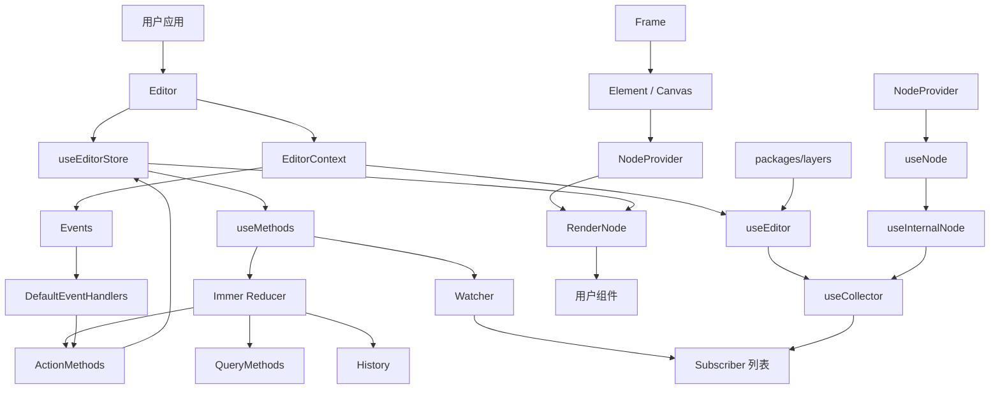

# Craft.js 整体架构

> 相关文档：[订阅机制与优化方向](./subscription-optimization.md)、[性能卡点分析与优化路线](./performance-bottlenecks.md)、[**性能排查交接文档**](./perf-handoff.md)
>
> ⚠️ **本文描述的是本 fork 的架构。** 订阅机制已从「全量广播」改为「按 Immer patch path 建索引」，
> 文中凡提到「每次通知遍历所有 Subscriber」的地方已就地更正。性能结论一律以
> [`perf-handoff.md`](./perf-handoff.md) 的实测为准。

## 概览

Craft.js 是一个基于 React 的可编辑页面框架。核心职责是把用户组件映射成可持久化的 Node 树，并通过统一的 EditorStore 管理节点数据、选择状态、拖拽状态、历史记录和事件连接器。

仓库是一个 Yarn workspace/Lerna monorepo，主要运行时包如下：

- `packages/core`：编辑器运行时、节点树、渲染、操作、查询和拖拽事件。
- `packages/utils`：通用状态方法、订阅器、历史记录、connector 和平台工具。
- `packages/layers`：基于 Craft 节点树的独立图层面板。
- `examples/basic`、`examples/landing`：本地可运行示例。
- `site`：Docusaurus 文档站点。

## 架构图



## 核心模块

### `packages/core/src/editor`

编辑器状态和公共操作的核心模块。

- `Editor.tsx` 创建 EditorStore，提供 `EditorContext`，同步 `enabled`，并在节点数据变化时通知 `onNodesChange`（**只在节点集合、某个 `node.data` 或 `options.resolver` 变化时回调**；hover / 选中 / `setDOM` 不触发，见 `perf-handoff.md` §5.10）。
- `store.tsx` 定义初始 `EditorState`，组合 Action、Query、History 和 patch listener。
- `actions.ts` 实现节点增删改移、选择、hover、dragged、DOM 注册和 indicator 管理。
- `query.tsx` 提供节点查询、规则判断、序列化、反序列化和拖放位置计算。
- `useInternalEditor.ts` 把 EditorContext、collector 和事件 connector 组合成内部 hook。
- `NodeHelpers.ts` 提供节点关系、规则和事件状态的查询接口。

核心状态结构为：

```ts
type EditorState = {
  nodes: Record<NodeId, Node>;
  events: {
    selected: Set<NodeId>;
    hovered: Set<NodeId>;
    dragged: Set<NodeId>;
  };
  options: Options;
  indicator: Indicator | null;
};
```

### `packages/utils/src/useMethods.ts`

通用状态容器，负责 Immer action、patch、History、当前 state 引用以及 Watcher/Subscriber。

> ⚠️ **已更正**：早期版本每次通知都遍历全部 Subscriber。当前实现按 Immer patch path 建了订阅索引，
> 声明了 `dependencies` 的订阅只在相关路径变化时被唤醒；未声明依赖的订阅仍走全局通道。
> 另外 `dispatch` 在 `newState === previousState` 时不再 `notify`。
> 唤醒之后，Subscriber 仍执行自己的 collector，并用 `isEqualWith` 判断结果是否改变。

### `packages/utils/src/useCollector.tsx`

React 与状态容器之间的适配层：首次执行 collector，通过 `store.subscribe()` 注册订阅，结果改变后调用 React `setState`，并将 `actions/query` 合并到 hook 返回值。

### `packages/core/src/hooks`

- `useEditor` 暴露编辑器级 collector、actions、query 和 connectors。
- `useNode` 暴露当前 Node 的 collector、Node actions 和 connectors。
- `useInternalNode` 从 NodeContext 取得 Node id，再通过 EditorStore 订阅该节点。

`useNode` 并不是独立的 NodeStore。它仍然订阅整个 EditorStore，collector 决定最终关心当前节点的哪些字段。

### `packages/core/src/nodes`

- `NodeContext` 保存当前 Node id。
- `NodeProvider` 将 Node id 提供给用户组件树。
- `Element` 和 `Canvas` 创建节点树中的节点。
- `NodeElement` 连接 NodeProvider 与渲染流程。

### `packages/core/src/render`

渲染链路为：

```text
Frame -> Element / NodeElement -> NodeProvider -> RenderNodeToElement
  -> useInternalNode -> Editor.options.onRender -> 用户组件
```

节点隐藏时，`RenderNodeToElement` 直接返回 `null`。

### `packages/core/src/events`

- `CoreEventHandlers` 定义 connector 接口。
- `DefaultEventHandlers` 实现 connect、select、hover、drag、drop 和 create。
- `Events` 从 Editor options 创建 handler 并提供 Context。
- `Positioner` 计算拖放位置。
- `RenderEditorIndicator` 渲染拖放指示器。

典型选择流程：

```text
mousedown/click -> DefaultEventHandlers.select
  -> actions.setNodeEvent('selected', ids)
  -> 更新 state.events.selected 和 node.events.selected
  -> Watcher.notify -> useEditor/useNode collector -> React 更新
```

### `packages/layers`

图层包拥有自己的 Layer 状态，但通过 `useEditor` 读取 Craft 节点树，并使用 Craft connectors 修改选择、hover 和拖拽状态。它是上层 UI 集成包，不替代 `packages/core` 的状态。

## 完整运行流程

### 初始化

```text
Editor -> useEditorStore -> useMethods -> EditorContext.Provider
  -> Events -> Frame/Element -> NodeProvider -> RenderNode
```

### Action

```text
用户调用 action 或 DOM connector -> dispatch(action) -> Immer reducer
  -> ActionMethods 修改 EditorState
  -> patches/inversePatches -> History -> normalizeNodes/patch listener
  -> Watcher.notify -> Subscriber collector -> isEqualWith
  -> 结果变化的组件调用 setState
```

### 持久化

```text
query.getSerializedNodes / query.serialize
  -> 遍历 state.nodes -> NodeHelpers.toSerializedNode -> JSON 字符串
```

恢复时通过 `deserialize`、resolver 和 NodeTree 重建内部节点。

## 关键设计边界

- EditorStore 是所有核心状态的单一数据源。
- Query 只读描述状态，Action 负责修改状态。
- Node 的 `data` 用于持久化，`dom` 和 `events` 用于运行时。
- `events` 同时维护 Editor 级 Set 和 Node 级布尔值，因此需要保持两者同步。
- 历史记录只针对需要记录的 action，选择、hover、DOM 注册等运行时状态不会进入历史。
- collector 订阅分两类：声明了 `dependencies` 的按 patch path 索引唤醒（`useNode` 自动登记 `['nodes', id]`），未声明的走全局通道。
  ~~当前 collector 订阅是全局广播后局部比较，而不是按字段或 Node 进行依赖追踪。~~（已过时）
- ⚠️ **性能提示**：按路径索引、no-op 去重这类订阅层优化，在真实业务项目（5000+ 节点）上实测**端到端收益为 0**——
  订阅与 collect 只占单次 mousedown 的约 2%。详见 [`perf-handoff.md`](./perf-handoff.md) §六-1。
