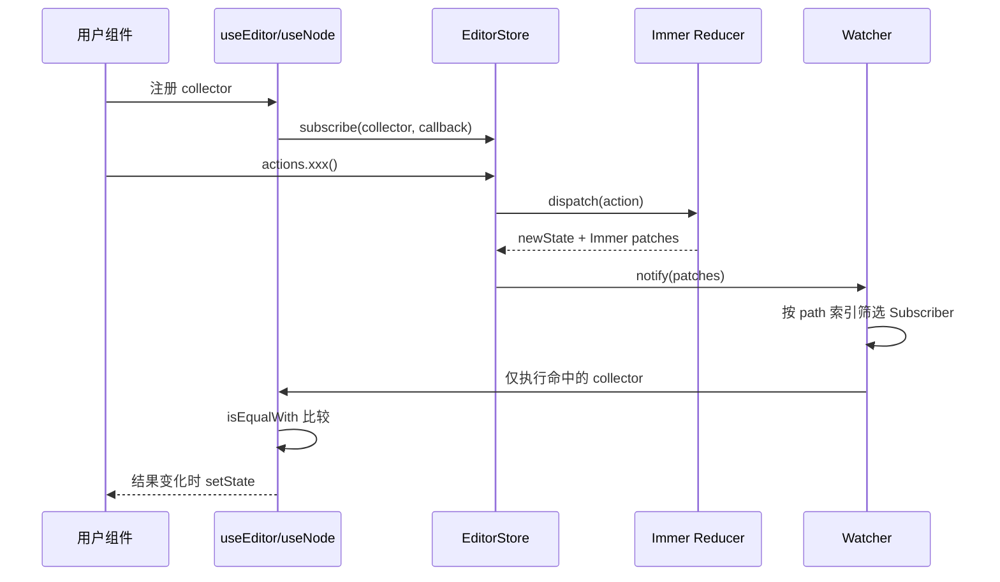

# Craft.js 订阅机制与优化方向

> 本文描述的是**订阅机制本身**的设计与已落地改动（no-op 去重、patch path 依赖索引）。
>
> ⚠️ **重要更正（2026-09-22，实测后）**：本文原本写着「真实性能问题主要由
> `Editor` 每次 dispatch 全量 `serialize()`、`RenderNode` 的 N 个全局订阅贡献」。
> **这个判断是错的。**
>
> - **订阅与 collect 只占单次 mousedown 的约 2%。** 本文的两层优化（no-op 去重、patch path 索引）
>   连同 `useCollector` 的 `initialCollected` 修复，三轮实测**端到端收益都是 0**：
>   结果变化数从 959 降到 67、collect 从 84.1ms 降到 32.7ms，而「到下一帧」583.4ms → 583.8ms，纹丝不动
> - 真正的瓶颈是 **Context 广播让几百个组件重渲染**，以及**画布外层 antd `ConfigProvider` 的引用不稳定**。
>   三刀见效的改动全在业务侧，单次点击帧从约 530ms 降到 97ms
> - 本文的改动仍然保留（逻辑更干净、无害），但**不要指望它们带来端到端收益**
>
> 结论一律以 [**性能排查交接文档**](./perf-handoff.md) 的实测为准，那里还有一份「已证伪的假设」清单。

## 实现后的链路

核心实现位于 `packages/utils/src/useMethods.ts`、`packages/utils/src/useCollector.tsx`、`packages/core/src/hooks/useEditor.tsx` 和 `packages/core/src/nodes/useInternalNode.ts`。



未声明依赖的旧订阅仍会进入全局兼容通道；声明依赖的订阅会按 Immer patch path 筛选。`isEqualWith` 继续负责阻止 collector 结果相等时的 React 更新。

## 已实现的订阅 API

`useEditor` 新增可选的第二个参数，路径段使用数组而不是字符串拼接，避免 Node id 中的特殊字符造成歧义：

```ts
useEditor(
  (state) => ({ selected: state.events.selected }),
  { dependencies: [['events', 'selected']] }
);
```

- 省略 `dependencies`：保持旧版全局广播，确保兼容任意 collector 和 query 间接读取。
- 依赖是变更路径的祖先：订阅 `['nodes']` 会收到任意节点变更。
- 依赖是变更路径的后代：写入 `['nodes']` 时会收到订阅 `['nodes', nodeId]` 的组件。
- `useNode(collector)` 自动登记 `['nodes', nodeId]`，其他 Node 的变化不再执行其 collector。
- action 没有产生状态变更时，`dispatch()` 不调用 `notify()`。

## useEditor 与 useNode

`useEditor(collect)` 的链路是：

```text
useEditor -> useInternalEditor -> useCollector -> store.subscribe
```

`useNode(collect)` 先从 `NodeContext` 取得 Node id，再把 collector 限定到：

```ts
state => id && state.nodes[id] && collect(state.nodes[id])
```

所以 `useNode` 逻辑上只关心一个 Node，但底层仍共享 EditorStore 的全局 Watcher。

## selected 状态的具体实现

### 状态存储

`selected` 同时存在于 Editor 级和 Node 级：

```ts
type EditorEvents = {
  selected: Set<NodeId>;
  hovered: Set<NodeId>;
  dragged: Set<NodeId>;
};

type Node = {
  id: NodeId;
  events: {
    selected: boolean;
    hovered: boolean;
    dragged: boolean;
  };
};
```

- `state.events.selected` 是当前所有选中 Node id 的权威集合，支持多选。
- `state.nodes[id].events.selected` 是对应 Node 的布尔镜像。
- 两者由 `setNodeEvent('selected', ...)` 一起更新，不能只修改其中一份。

### 写入入口

有两个常见写入入口：

```text
DOM select connector
  -> DefaultEventHandlers.select
  -> store.actions.setNodeEvent('selected', ids)
```

```text
公共 action
  -> actions.selectNode(id 或 null)
  -> setNodeEvent('selected', ids)
  -> setNodeEvent('hovered', null)
```

`DefaultEventHandlers.select` 负责根据多选键、当前选中状态以及祖先/后代关系计算新的 id 数组；真正修改状态的统一入口仍是 `setNodeEvent()`。

### 状态更新过程

当前 `setNodeEvent()` 的 selected 更新过程是：

```text
读取旧 state.events.selected
  -> 将旧 Node 的 events.selected 设为 false
  -> 创建新的 selected Set
  -> 解析传入 NodeSelector，只保留存在的 Node
  -> 将目标 Node 的 events.selected 设为 true
  -> 写回 state.events.selected
```

编辑器级 collector 可以直接订阅集合：

```ts
useEditor((state) => ({
  selected: state.events.selected,
}));
```

节点级 collector 通常读取 Node 镜像：

```ts
useNode((node) => ({
  selected: node.events.selected,
}));
```

查询 API 则通过 Editor 级集合判断：

```ts
query.node(id).isSelected();
// 内部等价于 state.events.selected.has(id)
```

### selected 的订阅触发

任何 selected 集合变化都会生成新的 EditorState，随后：

```text
setNodeEvent('selected', ids)
  -> Immer 生成新的 state
  -> Watcher.notify()
  -> 所有 Subscriber 执行 collector
  -> 读取 selected 的订阅者结果变化
  -> 对应组件重新渲染
```

只读取 `hovered` 或其他无关字段的 collector，最终结果不会变化，但当前实现仍会执行一次 collector；`isEqualWith` 只负责阻止后续 React 更新。

### selected 的优化要求

优化必须以 Editor 级集合为比较基准：

1. 先把输入 selector 解析成最终有效 Node id 集合。
2. 与 `state.events.selected` 比较数量和成员。
3. 集合相同时直接返回，不清理或重写 Node 镜像。
4. 集合变化时才同步旧 Node 和新 Node 的 `events.selected`。

因此以下调用应被视为 no-op：

```ts
actions.setNodeEvent('selected', ['node-a']);
actions.setNodeEvent('selected', ['node-a']);

actions.setNodeEvent('selected', ['node-a', 'node-b']);
actions.setNodeEvent('selected', ['node-b', 'node-a']);
```

顺序不同但集合相同，不应触发 selected 订阅广播。

## 当前是否存在 selectNode 输入比较

`selectNode()` 仍然不缓存原始输入；去重统一放在 `setNodeEvent()`，它比较解析、过滤后的有效 Node id 集合。

现有实现的行为是：

```ts
selectNode(nodeIdSelector) {
  // 有输入时先解析 selector，再调用 setNodeEvent
  this.setNodeEvent('selected', targets.map(({ node }) => node.id));

  // 无论 selected 是否变化，都会执行
  this.setNodeEvent('hovered', null);
}
```

需要区分两种比较：

- `selectNode()` 输入比较：当前不存在。传入相同 Node id、相同数组或相同 Node id 的不同数组顺序，都会继续执行内部逻辑。
- `setNodeEvent()` 目标集合比较：这是推荐新增的去重位置。应比较解析后的有效 Node id 集合，而不是直接比较原始 selector 引用。

因此不建议只在 `selectNode()` 外层比较输入数组：

- selector 可能是单个 id 或 id 数组。
- 数组顺序不代表 selected 集合顺序。
- 不存在的 Node 会在 `setNodeEvent()` 中被过滤。
- `selectNode()` 即使 selected 不变，也可能需要清除当前 hovered。

正确的最小优化边界是：由 `setNodeEvent()` 统一比较最终有效集合；当 selected 和 hovered 都没有变化时，再由 `dispatch()` 的 state 引用比较阻止 Watcher 广播。

## 重复广播根因

### 修复前：setNodeEvent 总是重建状态

当前实现每次都会清除旧事件、创建新的 Set、解析目标 Node id 并设置 Node event flag。即使目标集合和原集合完全相同，也会产生新的 Set 和 Immer state 变化。

### selectNode 仍会清除 hovered

```ts
this.setNodeEvent('hovered', null);
```

当 hovered 已经为空时，该调用没有业务效果，却会再次进入事件状态更新流程。

### 修复前：dispatch 总是广播

```ts
const newState = reducer(stateRef.current, action);
stateRef.current = newState;
watcher.notify();
```

即使 reducer 返回原 state 引用，Watcher 仍会遍历全部订阅者。

## 已实现修复

### 1. setNodeEvent 集合去重

文件：`packages/core/src/editor/actions.ts`

- 先将 selector 解析成目标 Node id 集合。
- 用集合大小和成员比较当前 `state.events[eventType]`。
- 集合完全相同则直接返回。
- 比较忽略传入数组顺序。
- 集合变化时保持 Editor Set 与 Node event flag 同步。

覆盖重复选中、重复 hover、重复清空，以及相同多选集合的不同数组顺序。

### 2. dispatch 跳过 no-op 通知

文件：`packages/utils/src/useMethods.ts`

```ts
const previousState = stateRef.current;
const newState = reducer(previousState, action);

stateRef.current = newState;
if (newState !== previousState) watcher.notify();
```

Immer 在没有实际修改时返回原 state 引用，因此不需要 dirty flag 或 action 注册表。

## 影响与边界

会改善：重复 `selectNode()`、重复 hover、重复清空事件和所有 no-op action 不再触发订阅回调或 React 更新。

> ⚠️ **实测补充**：上面这些「会改善」指的是**广播次数**，不是端到端耗时。
> 在 5000+ 节点的真实项目上，这部分优化的交互延迟收益为 0（见文首更正）。

保持不变：真实事件变化、Node 数据变化、History、patch listener 和公共 `subscribe` API。

> ⚠️ **`onNodesChange` 已不再「保持不变」**（2026-09-22）：它现在只在**节点集合、某个 `node.data`
> 或 `options.resolver` 变化**时回调，hover / 选中 / `setDOM` / `setIndicator` 不再触发。
> 中间一版曾把 collector 换成自增计数器，导致「每次 dispatch 都回调」，业务侧 debounce 之后
> 每次 hover 白跑一次全量序列化（实测每次约 45ms）。详见 [`perf-handoff.md`](./perf-handoff.md) §5.10。

未声明依赖的旧 collector 在真实 state 变化时仍会执行。按 patch path 的过滤已实现，调用方需要为高频 `useEditor` collector 显式声明准确依赖。

## 如何让 notify 按需通知

### 目标

假设有 1000 个组件：

```text
300 个订阅 events.selected
300 个订阅 events.hovered
300 个订阅某个 Node 的 data.props
100 个订阅 indicator
```

当 `events.selected` 变化时，理想流程应该是：

```text
action -> Immer patches -> 变更 key: events.selected
  -> 只通知 selected 订阅者
  -> 其余订阅者不执行 collector
```

当前 Watcher 没有依赖索引，无法做到这一点。

### 为什么不能只比较 collector 结果

当前流程是：

```text
notify -> 执行 1000 个 collector -> isEqualWith -> 丢弃 其中大部分结果
```

`isEqualWith` 只能阻止 React 更新，不能阻止 collector 本身执行。因此它无法解决“1000 个 collector 都被调用”的成本。

### 为什么不能只换成 useSyncExternalStore

`useSyncExternalStore` 可以改善 React 外部 store 的一致性和并发渲染兼容性，但如果底层 store 仍只有一个全局 listener 集合，状态变化时仍需要遍历这些 listener。它不是字段级通知机制。

## 可行的按需通知模型

### 1. 用 patches 生成变更 key

Immer 已经在 reducer 中生成 patches。可以把 patch path 转成稳定的失效 key：

```text
['events', 'selected']
  -> events.selected

['nodes', nodeId, 'data', 'props', 'text']
  -> nodes.nodeId.data.props.text
  -> nodes.nodeId.data.props
  -> nodes.nodeId

['nodes', nodeId, 'events', 'selected']
  -> nodes.nodeId.events.selected
  -> nodes.nodeId.events
  -> nodes.nodeId
```

实际实现可以保留完整 path，并在订阅注册时用前缀索引匹配；不需要为每个前缀复制完整 Subscriber 数组。

### 2. Subscriber 注册依赖

Subscriber 不能只保存 collector，还需要保存依赖 key：

```ts
type Subscription = {
  collector: () => unknown;
  onChange: (value: unknown) => void;
  dependencies: readonly string[];
};
```

Watcher 收到 patches 后，只收集与变更 key 相交的 Subscriber：

```text
patches -> changed keys
  -> dependency index 查询候选 Subscriber
  -> 只执行候选 Subscriber.collect()
```

这里必须保留一个全局订阅通道给无法声明依赖的旧 API，确保兼容性。

## useNode 可以先做细粒度订阅

`useNode` 已经知道当前 Node id，因此它是最适合优先优化的入口。

例如当前 Node 为 `node-a` 时，内部可以登记：

```text
nodes.node-a
```

这样：

- `node-b` 的 props 变化不会执行 `node-a` 的 collector。
- `events.selected` 变化需要同时失效相关 Node 的 `nodes.<id>.events.selected`。
- Node 被删除、移动或替换时，需要失效 `nodes.<id>` 和对应父节点路径。

selected/hovered/dragged 也可以使用独立的全局 key：

```text
events.selected
events.hovered
events.dragged
```

### selected 的特殊点

selected 有 Editor 级 Set 和 Node 级布尔镜像。一次 selected 变化可能影响：

```text
events.selected
nodes.oldSelectedId.events.selected
nodes.newSelectedId.events.selected
```

所以 patch key 生成不能只看 `events.selected`，还要覆盖被清除和被设置的 Node 镜像，否则使用 `useNode(node => node.events.selected)` 的组件会漏更新。

## useEditor 的难点

`useEditor(collector)` 接受任意 JavaScript 函数，例如：

```ts
useEditor((state, query) => ({
  selected: state.events.selected,
  descendants: query.node(state.events.selected).descendants(),
}));
```

仅从函数签名无法可靠推断它读取了哪些字段。要实现完整按需通知，只有三条路：

### A. 显式依赖声明，推荐

保留现有 API，同时增加可选依赖信息：

```ts
useEditor(
  (state) => ({ selected: state.events.selected }),
  { dependencies: [['events', 'selected']] }
);
```

优点是行为明确、运行时开销低、容易测试。缺点是调用方需要维护依赖列表。

### B. 针对常见 Hook 提供内部依赖

不改变公共 `useEditor` API，只先优化 `useNode`、selected/hovered/dragged 等固定场景；普通 `useEditor` 继续走全局兼容通道。

这是最小风险的渐进方案。

### C. Proxy 自动追踪读取路径

使用 Proxy 包装 state，在 collector 执行期间记录读取路径。

它可以减少手写依赖，但存在动态读取、query 间接访问、数组遍历、React Strict Mode、依赖集合生命周期和额外 Proxy 成本等问题。不能作为第一版方案。

## 推荐实施顺序

```text
第一步：no-op 去重
  -> setNodeEvent 集合比较
  -> dispatch state 引用比较

第二步：已实现的内部依赖通道
  -> Watcher 接收 patches
  -> useNode 按 Node id 注册依赖

第三步：已实现的可选公共 API
  -> useEditor 支持显式 dependencies
  -> 旧调用保持全局兼容通道
```

不建议一开始做 Proxy 自动追踪或完全重写订阅系统；先用 patches 和已知 Node id 验证收益，再决定是否扩大公共 API。

## 测试要求

- 同一 selected Node 连续设置两次，订阅回调只执行一次。
- 同一事件集合以不同数组顺序设置，不产生第二次通知。
- hovered 已为空时重复设置 `null`，不产生通知。
- `selectNode()` 连续选择同一 Node，不产生第二次通知。
- selected 不变但 hovered 有值时选择 Node，仍清除 hovered 并只产生一次有效更新。
- 真实 `setProp`、`setCustom`、`setHidden` 变化仍然通知。
- selected、hovered、dragged 三类事件互不误伤。
- History、normalizeNodes 在真实变更与 no-op action 下行为正确。
- `onNodesChange`：hover / 选中 / `setDOM` / 不改 resolver 的 `setOptions` **不**回调；`setProp` / `setHidden` /
  增删节点 / 撤销重做 / 更换 resolver **会**回调；订阅后的首次变化必定回调（见 `editor/tests/Editor.test.tsx`）。

## 本地验证

仓库根目录已有测试、构建和 lint：

```powershell
yarn test --runInBand
yarn build
yarn lint
```

`yarn dev` 会持续构建和监听 workspace 包，但不是浏览器 Demo 服务：

```powershell
yarn dev
```

现成的最小 Demo 是 `examples/basic`，它使用 workspace 版本的 `@craftjs/core`，端口为 `3002`。另开终端运行：

```powershell
yarn workspace example-basic start
```

然后访问 `http://localhost:3002`。也可以在 `examples/basic` 目录执行其 `start` script。

根目录 `cypress.json` 已将 Cypress base URL 配置为 `http://localhost:3002`，Demo 启动后可执行：

```powershell
yarn cy:test
```

重点手动验证重复点击、重复 hover、拖拽、props 编辑、撤销/重做、设置面板更新和页面刷新。
